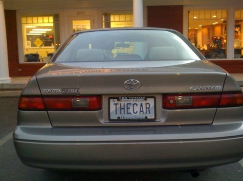
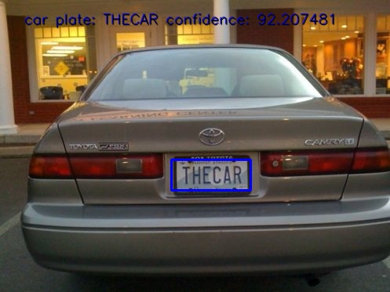
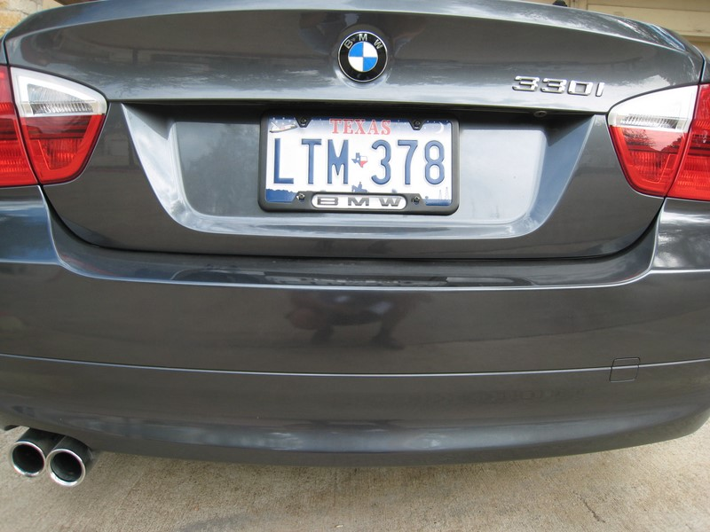
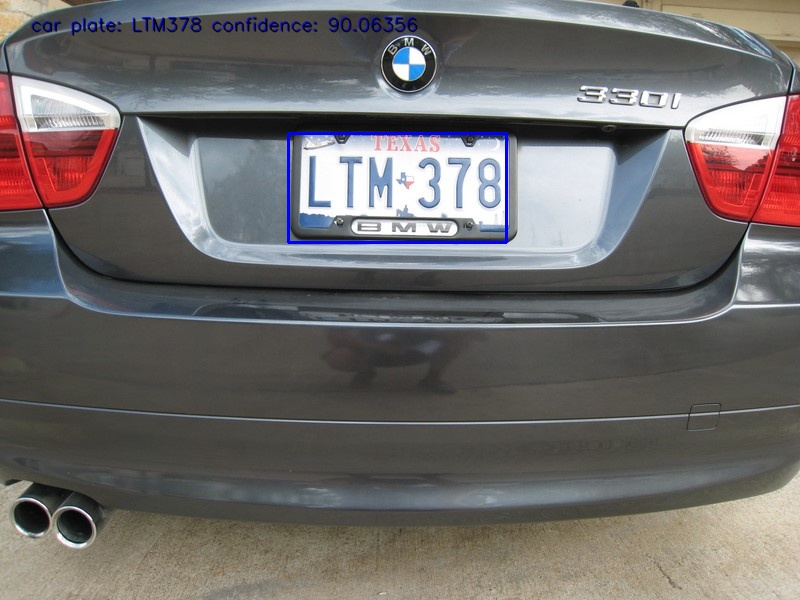

### Car plate recognition
Car plate recognition based on openALPR.

#### Usage
```pip install opencv-python```

Please read the readme.txt first in src folder.
```
python main.py .\res\us-1.jpg
Using OpenALPR 2.3.0
results=
 {'version': 2, 'data_type': 'alpr_results', 'epoch_time': 1654407710000, 'img_width': 497, 'img_height': 372, 'processing_time_ms': 2191.236084, 'regions_of_interest': [], 'results': [{'plate': 'THECAR', 'confidence': 92.207481, 'matches_template': 0, 'plate_index': 0, 'region': 'wa', 'region_confidence': 0, 'processing_time_ms': 17.764, 'requested_topn': 7, 'coordinates': [{'x': 218, 'y': 203}, {'x': 317, 'y': 201}, {'x': 319, 'y': 242}, {'x': 219, 'y': 244}], 'candidates': [{'plate': 'THECAR', 'confidence': 92.207481, 'matches_template': 0}, {'plate': 'THEGAR', 'confidence': 81.348961, 'matches_template': 0}, {'plate': 'HECAR', 'confidence': 80.229317, 'matches_template': 0}, {'plate': 'TMECAR', 'confidence': 78.159492, 'matches_template': 0}, {'plate': 'THE0AR', 'confidence': 77.702461, 'matches_template': 0}, {'plate': 'THECAB', 'confidence': 77.389, 'matches_template': 0}, {'plate': 'THEAR', 'confidence': 76.510017, 'matches_template': 0}]}]}
Image size: 497x372
Processing Time: 2191.236084
Plate #0
          Plate   Confidence
  -       THECAR   92.207481
  -       THEGAR   81.348961
  -        HECAR   80.229317
  -       TMECAR   78.159492
  -       THE0AR   77.702461
  -       THECAB   77.389000
  -        THEAR   76.510017
processing times:  2191.236084
plate= THECAR
confidence= 92.207481
coordinates= [{'x': 218, 'y': 203}, {'x': 317, 'y': 201}, {'x': 319, 'y': 242}, {'x': 219, 'y': 244}]
car plate: THECAR confidence: 92.207481
```

|||
|---|---|
|||
|||

#### Reference

openALPR [Github.](https://github.com/openalpr/openalpr)